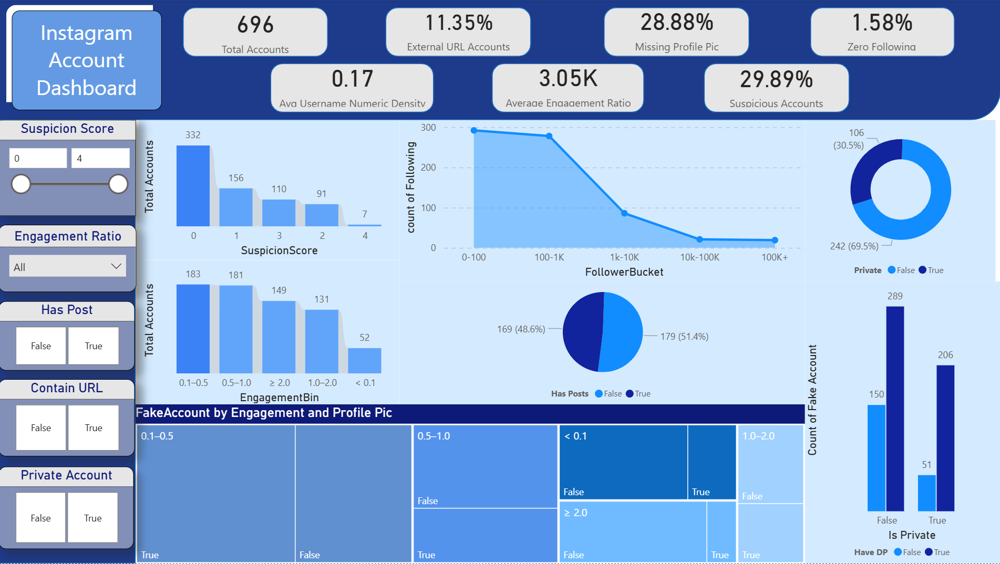

## Instagram Authenticity Detector: A High-Fidelity System to Identify Fake Accounts

## Project Goal

This project developed a high-performance **Ensemble Machine Learning Classifier** to automatically distinguish between **authentic (real)** and **inauthentic (fake/bot)** profiles on Instagram. The system's primary value is to provide a reliable tool for platform integrity, ensuring businesses and users interact with genuine accounts.

The project showcases a complete pipeline, from **innovative feature engineering** to **production-ready deployment** via a Streamlit dashboard.

## Dashboard Preview
Below is a live look at the Streamlit web application and the Power BI reporting dashboard built for this project:




-----

## Technical Core: Custom Feature Engineering & Production Pipeline

The success of our $94\%$ F1-Score was not just due to the model, but the custom feature creation, which amplified subtle signals of deception.

### 1\. The SuspicionScore

  * **Innovation:** We engineered a composite metric called the **`SuspicionScore`** within the `model_resources/preprocessing.py` module.
  * **What it does:** This score aggregates multiple low-level risk factors (e.g., zero posts, low engagement ratios, missing profile details) into a single, weighted risk indicator, dramatically improving the model's ability to spot hidden patterns of fraud.

### 2\. Workflow & Deployment Traceability

Our process clearly separates the experimental phase from the production phase:

| Phase | Notebook/File | Key Action |
| :--- | :--- | :--- |
| **Model Evaluation** | `notebooks/insta.ipynb` | Comprehensive **EDA** and **GridSearch** across multiple base models (XGBoost, KNN, etc.) to select the best candidates. |
| **Model Finalization** | `notebooks/insta_model.ipynb` | **Trained the final Ensemble Voting Classifier**, serialized the complete model and scaler using **`joblib.dump()`**, and generated final metrics. |
| **Deployment** | **`main.py`** | **Loads the saved pipeline using `joblib.load()`** and powers the Streamlit dashboard for real-time predictions. |

-----

## Key Performance Metrics

The Ensemble Model provides high confidence for the critical 'Fake Account' class:

| Metric | Value | Interpretation |
| :--- | :--- | :--- |
| **Accuracy** | **0.94** | High overall correctness of predictions. |
| **F1-Score (Fake Class)** | **0.94** | **The critical metric for risk:** Excellent balance between Precision (avoiding false alarms) and Recall (catching true fakes). |

*Reference: `model_metrics.csv`*

-----

## Repository Structure

The files are organized into logical groups to separate development work from production assets.

```
INSTA/
├── data/
│   ├── Insta_train.csv              <-- Training Dataset
│   └── Insta_test.csv               <-- Test Dataset
├── main.py                          <-- The Streamlit App (Loads model via joblib.load)
├── requirements.txt                 <-- Project dependencies
├── notebooks/
│   ├── insta.ipynb                  <-- EDA, Feature Engineering, and Base Model Evaluation
│   └── insta_model.ipynb            <-- Final Ensemble Training, Persistence (joblib.dump)
├── model_resources/
│   ├── insta_voting_model.pkl      <-- Saved Ensemble Model Pipeline
│   └── preprocessing.py             <-- Production Logic for SuspicionScore
├── BI Dashboard/
│   └── insta.pbix                   <-- Power BI Dashboard Asset
└── README.md                        <-- This documentation

### How to Run the Live Dashboard

1.  **Install requirements:** Ensure all necessary Python libraries (streamlit, joblib, sklearn, pandas, etc.) are installed.
2.  **Execute:** Run the application from your terminal:
    ```bash
    streamlit run main.py
    ```